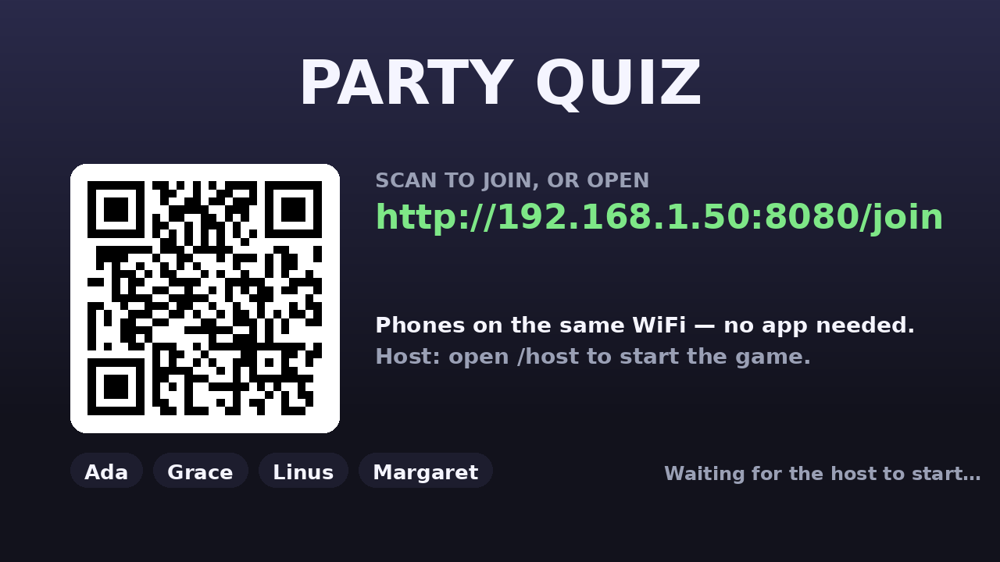
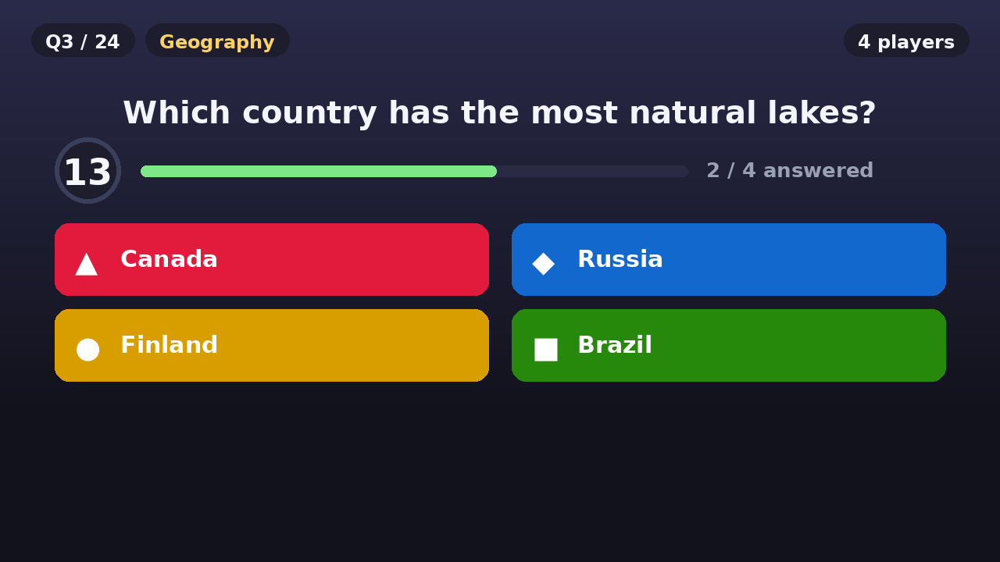
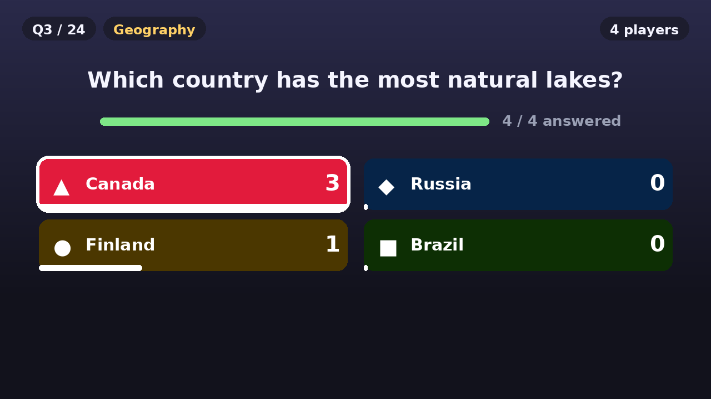
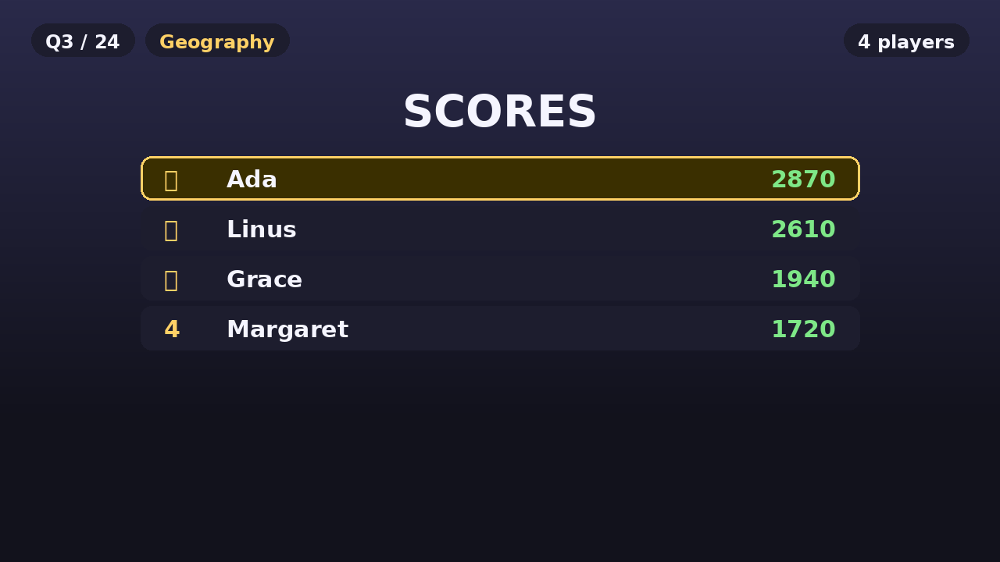
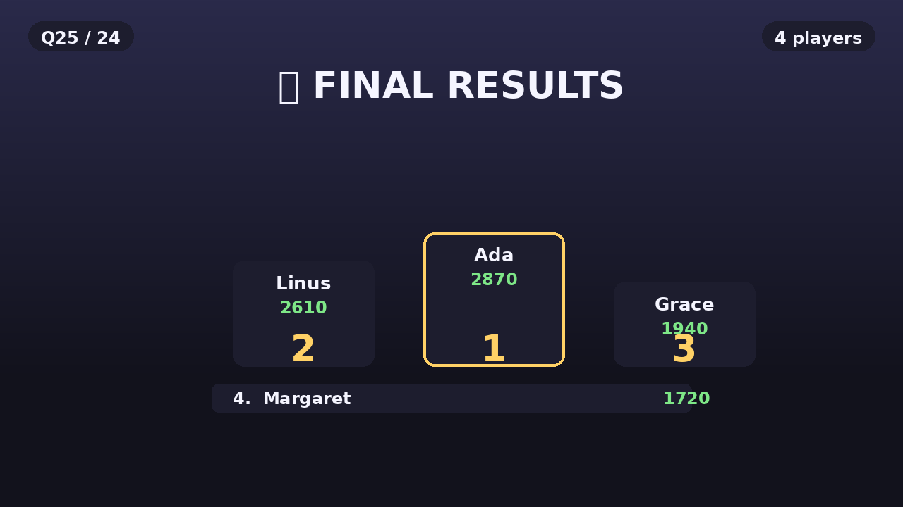

# Cast Party Quiz

A self-hosted quiz game where the **TV is the big screen** and **everyone's phone is a buzzer**. No app to install — players scan a QR code, type a name, and tap answers. Speed counts: faster correct answers score more.



<p align="center">
  
  
</p>
<p align="center">
  
  
</p>

## How it works

```
 phone (/join) ─┐
                ├─► server.py ──► render.py ──► ffmpeg ──► HLS ──► TV (Chromecast)
 host  (/host) ─┘     state          PNG frames     rolling playlist
```

- **`server.py`** owns the game state (a small state machine) and serves a JSON API plus three web pages.
- **`render.py`** draws each screen with Pillow. On low-power ARM boxes this is essential — a headless Chromium screenshot took **30–68 s** per frame, while Pillow renders one in ~0.1–0.4 s.
- **`tvstream.py`** pipes those frames into **ffmpeg**, which produces a rolling **HLS** playlist.
- The Cast device just plays that playlist as a normal **live stream** — so you don't need DashCast or a browser on the TV at all.

> Why not `catt cast_site <url>`? On some Cast firmware (e.g. Chromecast HD / Google TV) the DashCast receiver launches, reports *"Application ready"*, and then **never navigates** — the TV makes zero requests, even to a valid public HTTPS URL. Rendering to video sidesteps that entirely.

## Requirements

- Linux (tested on Debian 13 / Armbian, aarch64)
- Python 3.9+
- `ffmpeg` (a static build works — e.g. [johnvansickle.com/ffmpeg](https://johnvansickle.com/ffmpeg/))
- DejaVu fonts (present on most distros)
- A Chromecast / Google TV / Android TV on the same network
- Phones on the same WiFi

## Quick start

```bash
git clone <your-repo-url> party-quiz && cd party-quiz
python3 -m venv venv
./venv/bin/pip install -r requirements.txt

# put ffmpeg on PATH, or point FFMPEG= at a static binary
export PATH="$HOME/.local/bin:$PATH"

# start the server + the live stream
TV_IP=<your-tv-ip> ./start.sh

# cast the live screen to the TV
./venv/bin/python cast_tv.py --ip <your-tv-ip>
```

Then:

| Who | Open |
|---|---|
| **Players** | `http://<box-ip>:8080/join` (or scan the QR on the TV) |
| **Host** | `http://<box-ip>:8080/host` → **Start game** |
| TV | plays `http://<box-ip>:8080/stream/out.m3u8` |

Stop with `./stop.sh`.

### Finding your TV

```bash
./venv/bin/python -c "import pychromecast; c,_=pychromecast.get_chromecasts(timeout=10); print([x.name for x in c])"
# or cast by name instead of IP:
./venv/bin/python cast_tv.py --name "Living Room TV"
```

## Game flow & scoring

```
lobby → question (20s) → reveal (8s) → scores (7s) → question … → final podium
```

All timers are **server-side and auto-advancing**, so once the host hits *Start* the game runs itself. The host console can force any transition (`start`, `reveal`, `scores`, `next`, `add_time`, `restart`).

Scoring — correct answers are worth **500–1000 points** scaled by speed:

```python
points = int(500 + 500 * (time_remaining / question_seconds)) if correct else 0
```

Wrong answers score 0 (no other penalty). Ties break alphabetically by name.

## Configuration

| Env var | Default | Meaning |
|---|---|---|
| `PORT` | `8080` | HTTP port |
| `STREAM_DIR` | `/tmp/qz-stream` | where HLS segments are written |
| `FPS` | `1` | stream frame rate |
| `FFMPEG` | `~/.local/bin/ffmpeg` | ffmpeg binary |
| `TV_IP` | *(empty)* | enables the stall-recovering watchdog in `start.sh` |

Timings (`QUESTION_SECS`, `REVEAL_SECS`, `SCORES_SECS`, `MAX_POINTS`) are constants at the top of `server.py`.

## API

```
GET  /api/state[?pid=]        full state (correct answer hidden until reveal)
POST /api/join   {name}       -> {pid}
POST /api/answer {pid,choice}
POST /api/host   {action}     start|reveal|scores|next|add_time|restart
GET  /qr.png?u=<url>          QR code PNG
GET  /api/stats               request counters (handy for debugging the TV)
```

## Adding questions

Edit `QUESTIONS` in `server.py` — plain dicts:

```python
{"cat": "Space", "q": "Which planet spins on its side?",
 "options": ["Neptune", "Uranus", "Saturn", "Mercury"], "a": 1},
```

`a` is the index of the correct option. Add as many as you like; the game scales to the list length.

## The watchdog

Live HLS can stall if a segment is missed. `watchdog.py` checks whether the TV is **still fetching segments** (using `/api/stats` — *not* the Cast media status, which unreliable and reports `UNKNOWN` on a fresh connection even while playing) and re-casts if it stops. It deliberately does **not** fight you if you switch the TV to another app.

## Files

| File | Role |
|---|---|
| `server.py` | game state machine, JSON API, QR, pages, `/stream/` |
| `render.py` | draws a frame (lobby / question / reveal / scores / final) |
| `tvstream.py` | frame loop → ffmpeg → HLS |
| `cast_tv.py` | casts the live stream to a TV |
| `watchdog.py` | re-casts if the TV stops fetching |
| `start.sh` / `stop.sh` | process management (pidfiles) |
| `static/` | HTML versions of the pages (usable in a normal browser) |
| `tools/make_screenshots.py` | regenerates the images above |

## License

MIT — see [LICENSE](LICENSE).
